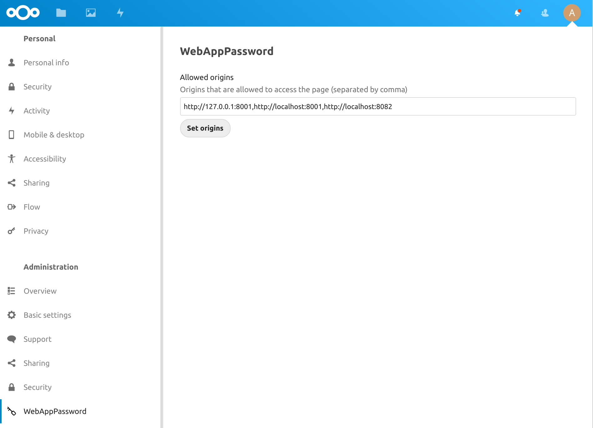
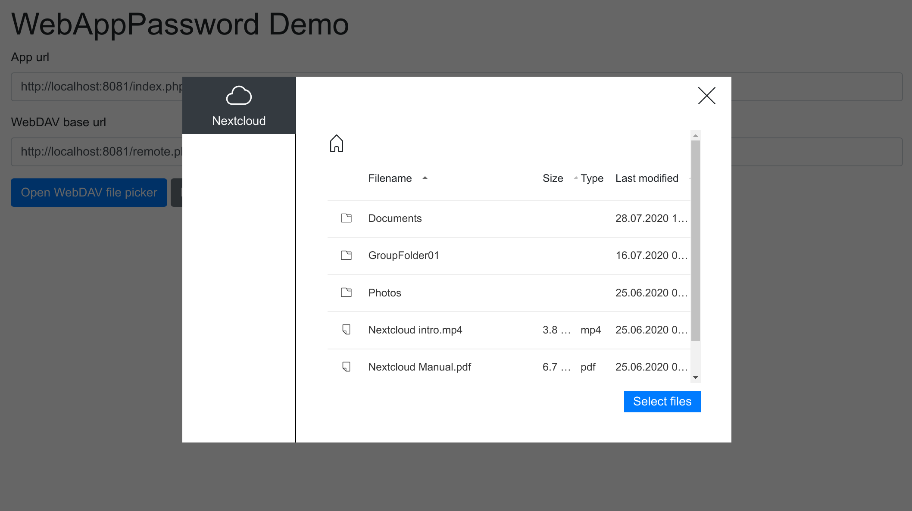
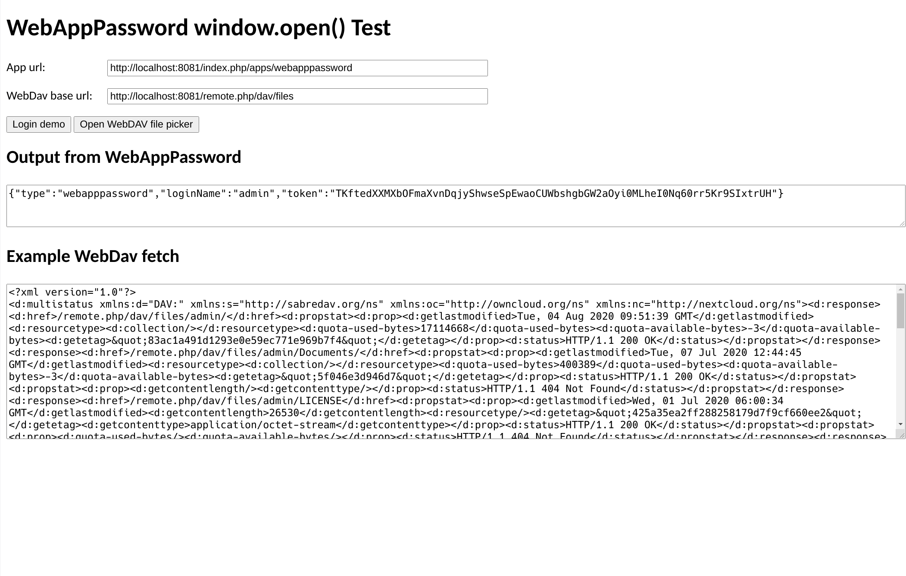

# [WebAppPassword](https://gitlab.tugraz.at/dbp/nextcloud/webapppassword)

[Nextcloud App Store](https://apps.nextcloud.com/apps/webapppassword) |
[Releases](https://gitlab.tugraz.at/dbp/nextcloud/webapppassword/-/releases) |
[Report issues](https://github.com/digital-blueprint/webapppassword/issues)

This is a Nextcloud app to generate a temporary app password and set CORS headers to allow
WebDAV access from inside a webpage.

Place this app in **nextcloud/apps/** or install it from the [Nextcloud App Store](https://apps.nextcloud.com/apps/webapppassword).

## Configuration

You can configure the allowed origins on the settings page of the application.



Alternatively you can also add this setting to your `config/config.php`
(it will be used if the origins setting on the settings page are empty).

`'webapppassword.origins' => ['https://example.com'],` - array of allowed origins

The setting is both used for the origin of the CORS headers for the WebDAV requests and
for the referrer check whether we want to generate a temporary app password.

## Docker

You can use this container for development and testing of the application.

```bash
cd docker
docker-compose up
```

* <http://localhost:8081> admin/admin
* (first time only) For the origin config see `WEBPASSWORD_ORIGINS` in docker-compose.yml

## Example

You can start a php server with `cd docs/example && php -S localhost:8082` to see an example
page on <http://localhost:8082/>.

If you have started the docker container you can login to your Nextcloud container with `admin`/`admin` and
receive a temporary app password for your user.

There also is our [Nextcloud file picker](https://gitlab.tugraz.at/dbp/web-components/toolkit/-/tree/master/packages/file-handling#filesource)
in the example.



Take a look at [index.html](docs/example/index.html) for the source code of the page.



## Running tests

You can use the provided Makefile to run all tests by using:

```bash
cd docker && make test
```

## Generate translation

You will need the [translationtool](https://github.com/nextcloud/docker-ci/tree/master/translations/translationtool)
to generate the translation files for all languages.

```bash
php /path/to/translationtool.phar convert-po-files
```

See: [Manual translation](https://docs.nextcloud.com/server/19/developer_manual/app/view/l10n.html#manual-translation)

## References

This Nextcloud application is used in the
[NextcloudFilePicker](https://gitlab.tugraz.at/dbp/web-components/toolkit/-/blob/master/packages/file-handling/src/dbp-nextcloud-file-picker.js)
web component to generate temporary app passwords and to allow WebDAV-access from
inside the web browser.
